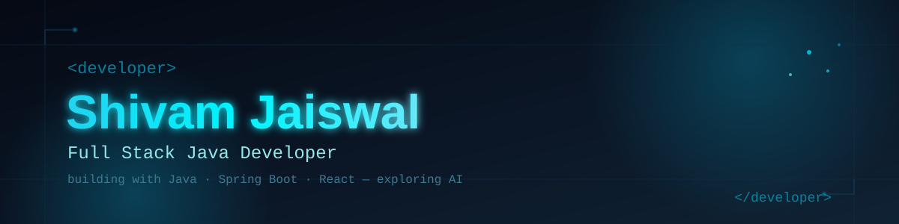
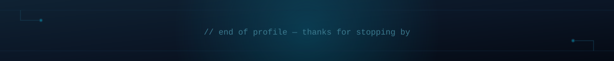

<div align="center">




<br/>

<a href="mailto:jaiswalss2002@gmail.com"></a>
<a href="https://github.com/Shivam7Jaiswal"></a>


<br/><br/>


</div>

<br/>

## `01` &nbsp;·&nbsp; About

```yaml
name:        Shivam Jaiswal
role:        Full Stack Java Developer
location:    Pune, India
education:   B.E. Computer Science, JSPM BSIOTR — 2025
focus:       Building with Java + Spring Boot + React
next_step:   Growing into a Java + AI Engineer
currently:   Exploring the fundamentals of AI/ML
```

<br/>

## `02` &nbsp;·&nbsp; Tech Stack

<table align="center">
<tr>
<td align="center" width="140"><b>Languages</b></td>
<td>


</td>
</tr>
<tr>
<td align="center"><b>Frontend</b></td>
<td>


</td>
</tr>
<tr>
<td align="center"><b>Backend</b></td>
<td>

</td>
</tr>
<tr>
<td align="center"><b>Database</b></td>
<td>

</td>
</tr>
<tr>
<td align="center"><b>Tooling</b></td>
<td>


</td>
</tr>
</table>

<br/>

## `03` &nbsp;·&nbsp; Currently Building

> 🛠️ **Full Stack Java Application** — *in progress*
> Details, tech stack, and repository link coming soon as the project takes shape.

<br/>

## `04` &nbsp;·&nbsp; Certifications

<div align="center">


</div>

<br/>

## `05` &nbsp;·&nbsp; GitHub Stats

<div align="center">


</div>

<br/>

## `06` &nbsp;·&nbsp; Contribution Snake

<div align="center">


</div>

<br/>

## `07` &nbsp;·&nbsp; Open To

<div align="center">


</div>

<br/>

## `08` &nbsp;·&nbsp; Connect

<div align="center">

<a href="mailto:jaiswalss2002@gmail.com"></a>
<a href="https://github.com/Shivam7Jaiswal"></a>

</div>

<br/>

<div align="center">

```
$ echo "Full Stack Java Developer | Building scalable applications and exploring AI."
```



</div>
